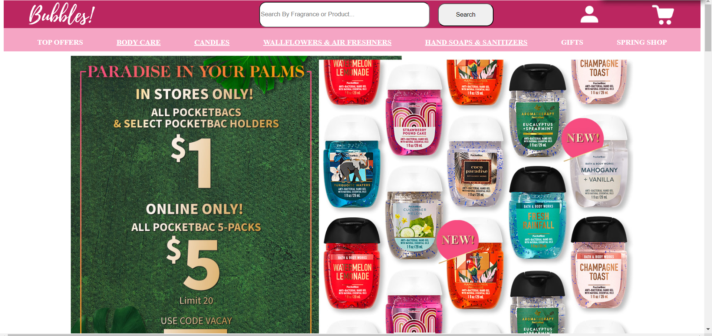
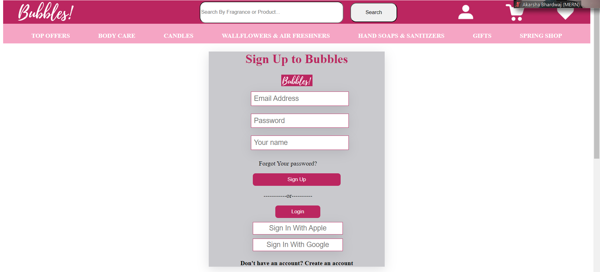
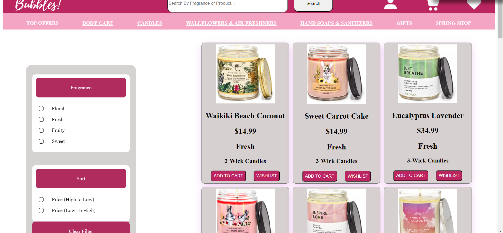
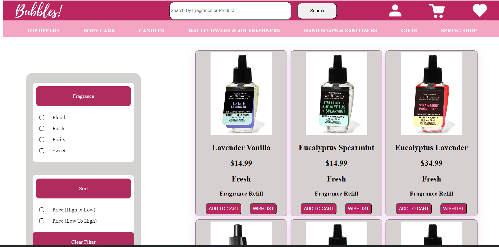
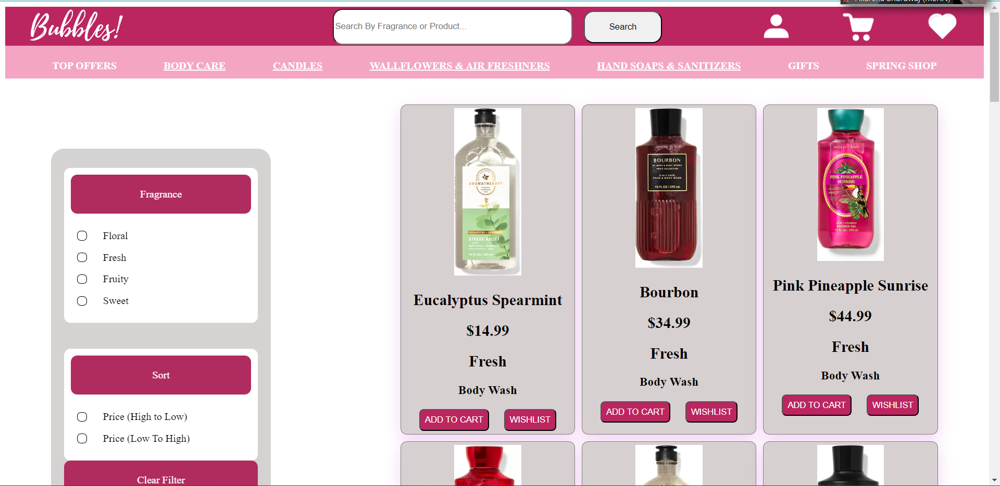
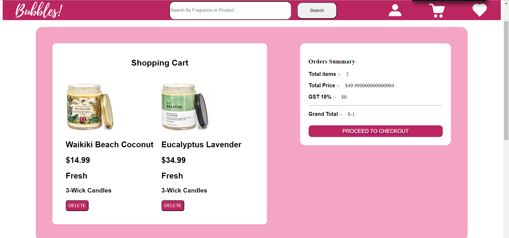
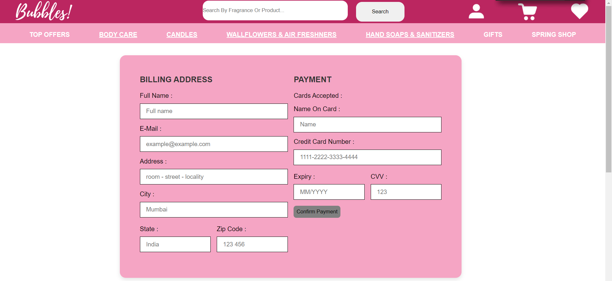

# Bubbles

## I tried to cloned Bath and Body Works.Com which is famous for best deal on all Bath products and many more across the globe.

## Built with
<ul>
 
  <li>HTML</li>
  <li>CSS</li>
  <li>mongoDB</li>
  <li>Express</li>
  <li>Bcrypt</li>
  <li>Jsonwebtoken</li>
  <li>cors</li>
  <li>JavaScript</li>
  <li>JSON server</li>
</ul>

## Used libraries
<ul>
  <li>node modules</li>
  <li>Styled-Components</li>
 <li>HTML Components</li>
 <li>Scripts files</li>
 </ul>

## Features
<ul>
  <li>Signup</li>
  <li>Login</li>
    <li>Sorting</li>
  <li>Individual Item Pages</li>
<li>Searching Functionality</li>
<li>filtering by fragrance</li>
 <li>Filtering by prices</li>
 </ul>

## Some screenshots of the project

## Home Page 

## LoginSignup Page 

## category page1

## category page2

## category page3

## cart done

## Checkout Page

### Thanks for reading

